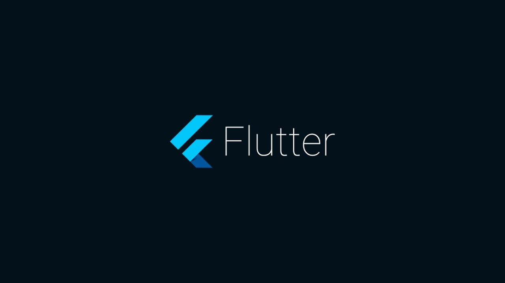

# Flutter

[Официальная страница](https://flutter.dev/)

Комплект средств разработки и фреймворк с открытым исходным кодом для создания мобильных приложений под Android и iOS, веб-приложений, а также настольных приложений под Windows, macOS и Linux с использованием языка программирования Dart, разработанный и развиваемый корпорацией Google

## Платформы

- Android
- iOS
- Google Fuchsia
- Веб-платформа
- macOS
- Windows
- Linux

[Официальная страница](https://flutter.dev/)

## Примеры приложений

1. Google Ads.
2. Alibaba.
3. Square.
4. Ebay.
5. Hamilton Musical.
6. Reflectly.
7. Groupon.
8. Cryptomaniac.